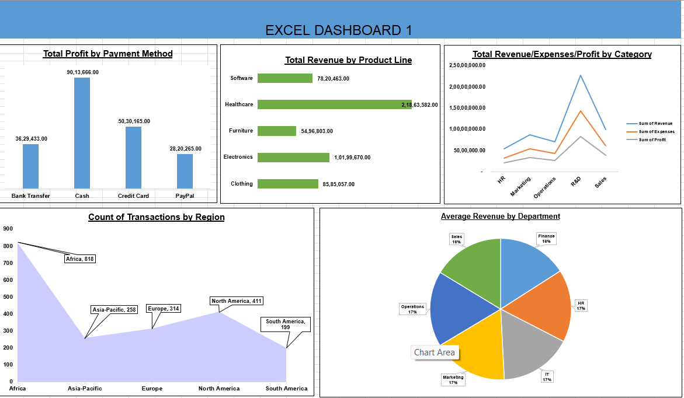

# Excel Sales Performance Dashboard

Advanced Excel dashboard analyzing **2,000 sales transactions** across multiple regions and product categories.  
The dashboard uses **Pivot Tables, slicers, and dynamic calculations** to generate business insights.

---

## Dashboard Preview



---

## Dataset Overview

- Total Transactions: **2,000**
- Total Revenue: **₹53M+**
- Total Profit: **₹20M+**
- Regions: **5**
- Product Categories: **5**
- Departments: **6**

---

## Dashboard Features

- 5 Pivot Tables
- Interactive Slicers (Region, Product, Department)
- Profit Margin calculations
- Regional sales analysis
- Product category performance analysis

---

## Key Business Insights

- Healthcare category generates the **highest revenue**
- Africa region has **high transaction volume**
- Electronics products have **lower margins**
- Profit margin across categories averages **~38%**

---

## Skills Demonstrated

- Advanced Excel
- Pivot Tables
- Data Analysis
- Dashboard Design
- Business Performance Reporting

---

## Repository Files

```
Excel-Dashboard-1.xlsx → Excel dashboard
dashboard-screenshot.png → Dashboard preview
README.md → Project documentation
```

---

## Author
Megha Kallapur  
GitHub: https://github.com/Megha-B-K  
Email: meghakallapur22@gmail.com
